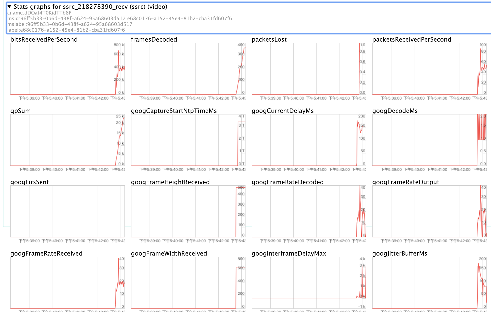
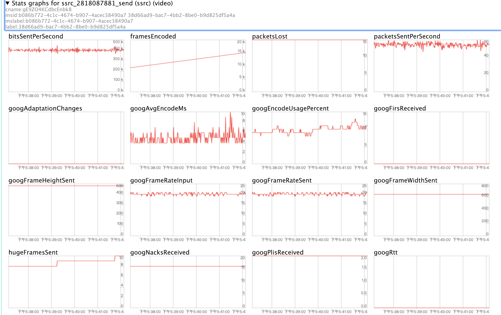

# [webrtc-stats-rfc](https://www.w3.org/TR/webrtc-stats/)
> current webrtc-stats implement by google internal method. because implement it sample. such as which codecname you use now. in rfc ,you show find codecId in codecmap
### pre-handle from native stats
{key: Arrays} => Arrays

## [LibWebrtc](https://webrtc.org/native-code/)

## [Which element in webrtc API stat refer to incoming bit rate](https://stackoverflow.com/questions/27699144/which-element-in-webrtc-api-stat-refer-to-incoming-bit-rate)

> checkAddress
- https://webrtc.github.io/samples/src/content/peerconnection/constraints/

## Video Params
video down 统计信息中的如下属性：
googNacksSent、googPlisSent、googFirsSent

注：来源于 video recv

video up 统计信息中的如下属性：
googNacksReceived、googPlisReceived、googFirsReceived

注：来源与 video send

